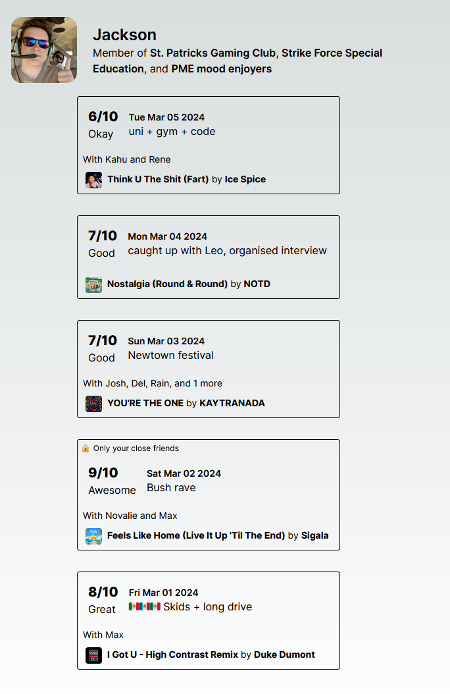

# Moodbd
(Moodbored?)

Mutual mood micro management.

### Explanation
Moodbored is a hybrid between a **social media platform** and a **personal diary/mood tracking service.** It allows users to post one update per day (called a "mood"), with a numeric rating, a list of people who were involved, and a particular song (optional).
 Other users can see their moods, and like/react/comment on them.  

In the future, users will be able to see how their mood changes over time, over a variety of time scales.

### Moderation
Users may be tempted to artificially inflate their mood rating, or to post false/misleading mood updates. To combat this, Moodbored shows the average mood rating for a user, based on their recent and long-term mood activity. In this way, any user with a seemingly high mood rating can be identified.
### Rationale
Moodbored was conceived and designed by people with autism, attention-deficit hyperactivity disorder (ADHD), and borderline personality disorder. It is designed to help people understand, express, and monitor their emotions. By allowing people to make private, small (or large) updates, it also allows their loved ones to easily check in and see how they might be doing, when they are too afraid to share.

However, it is open to everyone.

### Example

### Future Plans & Roadmap
- [ ] Trend analysis
  - Mood over time
  - Mood by day of the week
  - Mood by time of day?
- [ ] Custom scales (a la Letterboxd, Rate Your Music)

#### Copyright
&copy; 2024 Jackson Rakena, MIT License